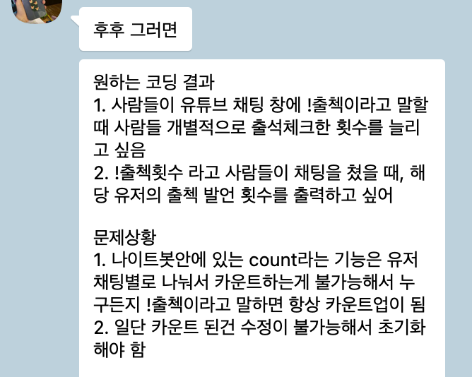
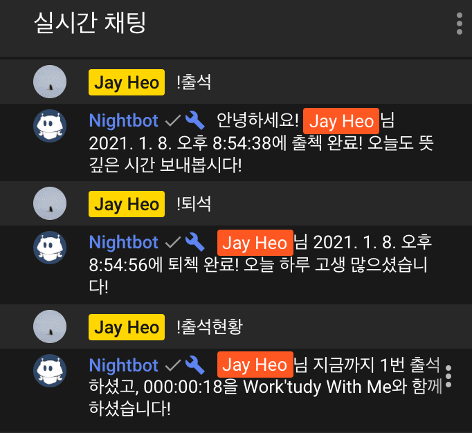

안녕하세요. 오늘은 Nightbot과 Google 스프레드시트를 이용해 간단한 출결관리 챗봇을 도입한 후기에 대해 이야기하고자 합니다. 로직이 워낙 간단해서 구체적인 사용 방법이나 코드 설명 대신 사고의 흐름을 따라 서술해보려고 합니다.

## 들어가며

영어 학원과 유튜브를 하고 있는 친구가 최근 "Study with me"라는 컨텐츠를 시작했습니다. 라이브 방송을 켜두고 공부 하는 모습을 중계하면서 공부에 집중되는 소리를 들려주는 컨텐츠입니다. 같이 공부하는 느낌이 들어 저도 가끔 밤에 코딩을 하거나 블로그에 글을 쓸 일이 있으면 이 방송을 켜두고 작업을 하곤 합니다. 그러다 어느 날, 친구로부터 다음과 같은 카톡을 받았습니다.

> "채팅창의 봇을 이용해서 출석체크를 할 수 있으면 좋겠다."

아마 모든 공대생들이 그렇겠지만, AS-IS와 TO-BE가 구체적으로 담긴 정성스러운 스펙이 들어오면 (그걸 진행할 것인가와는 별개로) 몸이 먼저 반응을 하게 됩니다. 어느샌가 저는 챗봇의 작동원리에 대해서 찾아보고 있었습니다.

친구가 구현하고 싶은 요건은 크게 2가지 명령어로 요약될 수 있었습니다.

1. `!출석`/`!퇴석`: 시청자의 출석/퇴석 시간을 기록함.
2. `!출결현황`: 현재까지 출석한 일수와 누적 시간을 반환함.

구현 자체는 큰 어려움이 없었지만, 이 봇을 운영하는 주체가 개발에 익숙하지 않다는 점이 또 하나 생각해야 할 포인트였습니다. 따라서 저는 여기에 2가지 조건을 더 해서 고민하기로 했습니다.

1. 최대한 간단한 형태로 구현되어 있어야 한다.
2. 관리 포인트는 최대한 줄인다.

그리고 최종적으로 저희가 설계에 활용하기로 한 플랫폼은 Nightbot과 Google 스프레드시트였습니다.

## [Nightbot](https://nightbot.tv/)

메세지를 출력할 봇은 선택지가 많지 않습니다. 따라서 가장 대중적이고, 이미 친구가 사용중이던 Nightbot을 사용하기로 했습니다. 나이트봇은 라이브 방송의 채팅을 자동화 할 수 있는 Twitch 및 YouTube용 채팅 봇입니다. 나이트봇의 대표적인 기능 중 하나는 명령어입니다. 예를 들어, 채팅창에 `!songs` 를 입력하면 시청자가 노래를 신청할 수 있습니다. 그 외에도 채팅 로그를 기록하거나, 방송 통계를 제공하는 등의 기능도 제공합니다. 만약 위 플랫폼의 인터넷 방송을 보시는 분이라면 채팅창에서 한 번쯤 보셨을 것 같습니다.

이미 많은 유저들이 다른 웹앱의 도움 없이 나이트봇만으로 다양한 명령어를 만들어 방송을 운영하고 있었습니다. 하지만 저희가 원하는 기능을 구현하기에는 한계가 있었습니다. 그렇다고 챗봇을 직접 구현을 하는 것도 적절하지 않다고 생각했습니다. 다행히 나이트봇의 [urlfetch](https://docs.nightbot.tv/variables/urlfetch) 변수를 활용하여 API를 호출할 수 있었고, 나이트봇을 단순 클라이언트로 사용하고 서버 역할을 할 다른 플랫폼을 찾기로 했습니다.

## Google 스프레드시트

출결을 관리해야 하기 때문에 이 앱은 필연적으로 Stateful할 수 밖에 없습니다. 어떤 데이터베이스를 사용할까 고민을 하던 끝에 저희는 Google 스프레드시트를 사용하기로 했습니다. Google 계정만 있다면 누구나 무료로 사용할 수 있고, 스프레드시트는 누구에게나 친숙한 데이터베이스이기 때문에 친구도 쉽게 편집이나 통계를 구하는 등 활용할 수 있었습니다.

무엇보다 스프레드시트를 사용한 결정적인 이유는 [Google Apps Script](https://developers.google.com/apps-script) 를 활용할 수 있다는 점이었습니다. Google Apps Script는 자바스크립트 기반의 스크립팅 언어로, 이 언어를 사용하여 스프레드시트의 CRUD가 가능합니다. 별도의 설치도 필요 없이 브라우저에서 코드 편집기가 제공되고 스크립트가 Google 서버에서 실행됩니다. 그리고 이를 웹앱으로 배포할 수도 있습니다. 따라서 앱을 배포할 서버를 운영, 관리할 필요가 전혀 없습니다. 저는 이번에 처음 알게 됐는데, 자바스크립트 기반이기 때문에 학습 난이도도 높지 않고, 별다른 설정 없이 스크립트를 간단하게 웹앱으로 빌드해주고, 버전 별 배포관리도 해준다는 점 등이 맘에 들었습니다. 스프레드시트 이외에 다른 구글의 서비스들과도 연동이 되기 때문에, 이후에도 다양한 용도로 사용할 것 같습니다.

불편한 점이 있다면 디버깅을 비롯한 대부분의 개발 작업을 모두 구글에서 제공하는 온라인 스크립트 편집기를 사용해야 한다는 점입니다. 인터넷 상태에 따라 개발에 어려움을 줄 정도로 느려질 때도 많아서 로컬에서 자바스크립트로 최대한 구현한 다음, Sheet를 읽고 쓰는 부분만 따로 테스트하는 형태로 진행했습니다.

이 글에서 사용된 코드는 [heojay/attendance-chatbot](https://github.com/heojay/attendance-chatbot)를 참고하시기 바랍니다.

## 마치며

다음과 같은 느낌으로 구현이 됐고, 이렇게 해서 나이트봇과 구글 스프레드시트라는 플랫폼을 적절히 활용하여 소기의 목적을 달성했습니다. 물론 지금의 접근이 완벽한 해결책이라고 볼 수는 없습니다. 가장 큰 문제는 나이트봇 명령어 사이에 최소 5초의 Cooldown이 있어 동시에 같은 명령어가 여러 개 들어오는 경우를 처리할 수 없다는 점입니다. 가장 이상적인 환경이라고 가정해도 2160명 이상이 시청하는 대기업 유튜버가 진행하는 방송이라면 이 솔루션을 그대로 사용할 수 없습니다. 또한, 구글 스프레드시트의 경우 서버를 직접 관리하지 않아도 된다는 장점은 커스터마이즈하기 어렵다는 단점과 불가분의 관계입니다. 그렇지만 이렇게 접근한 덕분에 일주일도 걸리지 않아서 목적을 달성할 수 있었습니다. 저는 최고의 가성비로 문제를 해결했다는 점에서 만족하고 있습니다.

이번 일을 하면서 입사 초반 스프린트가 떠올랐습니다. 어려운 작업을 잡은 주였습니다. 그럼에도 좋은 모습을 보여드리고 싶어 완성도에 신경쓰다보니 기술 스택을 다루는 일도 벅찼고, 기능 구현도 제 역량 밖이었습니다. 결국 일주일 동안 거의 아무런 성과를 내지 못했고, 그 당시 팀원들로부터 2가지 피드백을 받았습니다.

1. 최소 기능 구현에 집중해라.
2. 닭 잡는데 소 잡는 칼을 쓰지 마라.

그 때의 피드백을 조금이나마 제 것으로 만든 것 같아 다행입니다.

## 그 외

- 이 글에 소개된 출결 관리 봇은 [돤글리시](https://www.youtube.com/channel/UCoXq4zU8s-oMizH1w6vFQOw)에서 진행하는 라이브 방송에서 사용됐습니다.
- 나이트봇에는 한글이 포함된 링크를 urlfetch로 보내려고 하면 에러가 발생하는 문제가 있습니다. 이 때는 querystring 변수로 한글을 한 번 감싸주면 문제가 해결됩니다.
- [Google Apps Script 생활코딩 강의](https://youtu.be/THly_FR7cWA)
