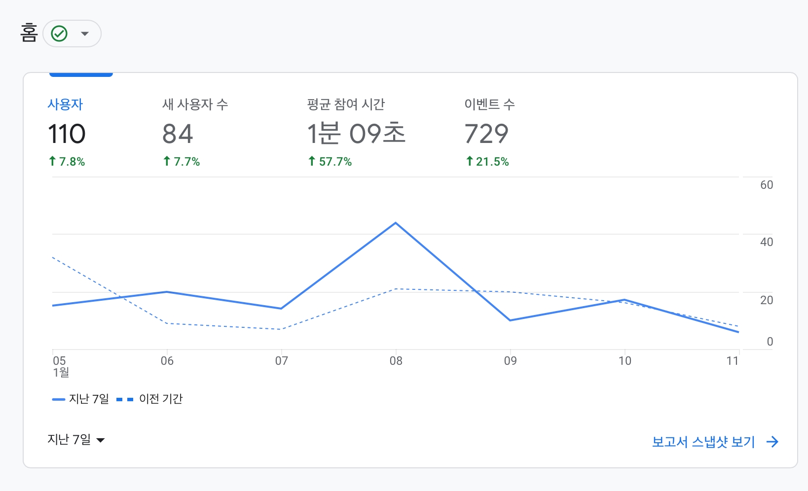

결혼을 앞두고 저는 불현듯 온라인 청첩장을 직접 만들어야겠다고 생각하게 됩니다. 사실 이제껏 살면서 웹 개발을 진지하게 해본 적이 없었던 저였기 때문에 이런저런 우여곡절이 있었습니다. 이번 글에서는 온라인 청첩장을 만들게 된 배경과 만들면서 고민했던 지점들, 그리고 다 만들고 나서 느낀 청첩장 개발 후기를 이야기해보려고 합니다.

> 이 글에서 소개된 청첩장의 [링크](https://wedding-invitation-heojay.vercel.app)입니다.

## 시작하게 된 이유

모바일 청첩장을 시작하게 된 가장 큰 계기는 **자기 점검**이었습니다.

저는 현재 클라우드 플랫폼 개발자로 일하고 있습니다. 인프라 리소스, 특히 쿠버네티스를 추상화하여 다른 개발자들이 더 쉽게 인프라를 활용할 수 있도록 돕는 개발을 하고 있습니다. 그중에서도 주로 백엔드 개발을 위주로 하다 보니 작년까지는 회사 업무 중에 웹 UI를 만드는 일은 거의 없었습니다.

다만 제가 일하고 배우는 과정에서 제가 하는 일이 좀 더 유의미해지려면 결국 웹 UI를 다루는 능력이 필요하다고 생각했습니다. 추상화라는 것은 복잡하고 다양한 니즈를 단순화되고 대중적인 선택지로 좁히는 일이고, 이를 직관적으로 전달하기 위해서는 UI가 필수라고 생각했기 때문입니다. AWS로 따지면 AWS CLI, API도 옵션이 될 수 있지만, 대시보드가 가장 직관적인 것처럼 말입니다.

팀 내에서도 비슷한 의견이 모였고, 올해 초부터 [Svelte](https://svelte.dev)를 이용한 프론트엔드 개발 업무를 부분적으로 시작했습니다. 시간이 지나 어느덧 나름 웹개발에 자신감이 붙어 "내가 원하는 페이지를 만들 힘이 있을까?" 를 시험해보고 싶었는데, 그때 마침 온라인 청첩장이라는 소재가 생겼습니다. 자기 점검의 좋은 과제가 될 수 있을 것 같아 호기롭게 “모바일 청첩장은 내가 만들게”라고 여자친구(이하 고객)에게 선언하고 개발을 시작하게 됩니다.

그 외에도 “개발자라면 직접 청첩장 정도는 만들어야지.”라는 생각도 있었습니다. 이해당사자가 많다보니 아무래도 중간 중간 수정할 일이 많았는데 (더 예쁜 사진으로 고친다거나, 내용을 추가한다든가) 만약 직접 만들지 않고 업체를 통해 개발했다면 이런 수정에도 제약이 많았을 것 같다는 생각이 듭니다.

## 개발자는 개발에만 집중할 수 있도록

이 단락에 부제를 붙여본다면 “SaaS의 시대” 정도가 되지 않을까 싶습니다. 이번 청첩장 개발에서는 최대한 편하게 인프라 구성을 가져가려고 노력했습니다. 항상 그렇지만 공급자의 입장에 있을 때 보는 시각과 사용자 입장에 있을 때 보는 시각이 많이 다른 것 같습니다. 클라우드 플랫폼 개발자로서, 최대한 여러 서비스를 체험해보면서 현업에서 개발할 아이템의 영감을 얻어보고자 했습니다. 추가로 무료 Plan만으로 구성하여 비용에도 이점을 가져갈 수 있도록 하면 좋겠다고 생각했는데, 의외로 무료 Plan으로도 알찬 기능을 제공하고 있어서 이번 개발에는 추가 비용이 발생하지 않았습니다. 기술적 요건이 복잡하지 않다 보니 주로 편의성을 본 것 같습니다.

이하는 제가 사용한 주요 SaaS 들입니다. 사용한 서비스 모두 웹 UI가 잘되어 있다는 점을 보면서 웹 UI를 열심히 익혀야겠다는 생각에 확신을 더하게 됐습니다.

### [Vercel](https://vercel.com)

가장 먼저 찾아야 했던 것은 호스팅 서버였습니다. 그동안 Netlify, Railway, Heroku 등을 사용했지만, 이번에는 예전부터 꼭 사용해보고 싶었던 Vercel을 써보기로 했습니다. 깔끔한 UI가 주는 첫인상도 좋았고, 한국 Region을 제공한다는 점이나 무료 플랜의 build 시간으로 한 달에 100분이 지원된다는 점 등이 마음에 들었습니다. 아마 앞으로도 이런 취미 프로젝트에서는 제일 처음 선택할 옵션이 될 것 같습니다.

### [MongoDB Atlas](https://mongodb.com/atlas)

꼭 있었으면 하는 기능 중의 하나가 방명록 기능이었기 때문에 데이터베이스(내지는 스토리지)가 필요했습니다. DB 없이 댓글을 만드는 방법으로 [utterances](https://utteranc.es/)나 [Disqus](https://disqus.com/) 같은 도구를 사용하는 방법도 있습니다만, 어느 쪽이든 소셜네트워크 로그인이 필요하다는 것(=방문자가 귀찮아서 쓰는 것을 포기하게 될 것)이 마음에 걸렸습니다. 그래서 괜찮은 DBaaS가 없나 찾아보던 중, Vercel의 Add-on으로도 제공되고 있는 MongoDB Atlas를 선택하게 됐습니다. 컴퓨팅 리소스를 공유하는 Shared Cluster의 경우 512MB까지는 무료로 제공되는데, 이 정도면 방명록을 담기에는 충분한 크기였습니다. (저는 사용하지 않았지만) 기본적으로 제공하는 Data API가 있어 이걸로 Read/Write가 가능하다는 점도 인상적이었습니다.

### [cron-job.org](https://cron-job.org/en/)

개인적으로 이번 프로젝트 중에서 제일 마음에 드는 서비스입니다. 하는 일은 단순한데, 일정 시간마다 한 번씩 HTTP Request를 보내 Health Check를 해주는 서비스입니다. 무료 플랜의 경우 유료 플랜에 비해 Response Size나 하루 API Call의 제한이 있기는 하지만, 청첩장이 제대로 응답하는지 확인하는 정도는 문제없어서 유용하게 사용하고 있습니다.

### [DALL·E 2](https://openai.com/dall-e-2/)

웹사이트에 넣을 이미지를 찾다 보니, 예쁜 이미지는 대부분 저작권이 있다는 것을 알게 됐습니다. 출처를 표시해야 하거나 워터마크가 있는 경우가 많아 웹페이지에 넣을 적절한 이미지를 찾는 것이 생각보다 쉽지 않았습니다. 그러던 중 인터넷에서 한창 Stable Diffusion이 붐을 일으키는 모습을 보게 되고 저는 직접 만들면 되지 않을까? 라는 생각을 하게 됐습니다.

OpenAI가 만든 DALL·E 2는 자연어로 된 설명으로 이미지를 만들 수 있는 AI 시스템입니다. 일정 개수까지는 무료 크레딧으로 만들 수 있고, 이렇게 만들어진 이미지는 자유롭게 사용할 수 있습니다. 현재 AI로 만든 이미지는 인사말의 꽃 리스 한 장만 사용되고 있지만, 그 한 장이 마음에 무척 들어 아마 다음 기회에도 필요한 이미지가 있다면 다시 찾지 않을까 생각합니다.

## 구현하면서

### Svelte(Kit)

앞서 잠시 언급했지만, 이 웹사이트는 Svelte로 개발됐습니다. Svelte가 가진 다양한 장점이 있지만, 그 중에서 결국 개발 중에 가장 와닿은 것은 **직관적이다** 라는 것이었습니다. Component Framework로서 Boilerplate 없이 그저 원래 HTML/CSS/JS를 쓰듯 사용할 수 있다는 점이 정말 편했습니다. 데이터를 쉽게 정의하고 관리하는 점도 좋고, Component를 이용해 재활용성 높은 코드를 작성할 수 있는 점도 좋았습니다.

그리고 [SvelteKit](http://kit.svelte.dev)은 Application Framework로서 이렇게 우아하고 편리한 Svelte를 어떻게 Application으로 만들 것인가? 에 대한 해답을 제공합니다. Routing이나 환경 변수 관리, Layout 등 Web Application을 만들면서 고민되는 부분을 모두 도와준다는 점이 가장 와닿았습니다. SvelteKit은 제가 청첩장을 개발할 당시만 해도 SvelteKit이 정식 Release가 안됐지만 (그래서 저도 개발 중에 [파일 이름이 바뀌고 사용하던 문법이 바뀌는 대격변](https://github.com/sveltejs/kit/discussions/5774)을 한 번 겪었습니다), 현재는 [1.0이 출시되었기 때문에](https://svelte.dev/blog/announcing-sveltekit-1.0) 웹 개발에 관심이 있는 모든 사람에게 적극적으로 추천하고 싶습니다.

### 디자인

미적 감각이 부족하고, 개발적으로는 CSS, 개발 외적으로는 포토샵과 같은 툴을 다루는 능력도 부족했던 저는 처음에는 심플한 디자인을 목표로 개발을 시작했습니다. 하지만 아름다운 초대장을 원했던 고객의 니즈에 따라 저는 서둘러 쉽고 예쁘게 디자인할 방법을 찾기 시작했습니다.

[TailwindCSS](https://tailwindcss.com/)와 [DaisyUI](https://daisyui.com/)는 그런 배경에서 선택한 스택이었습니다. TailwindCSS는 미리 세팅된 유틸리티 클래스를 사용하기만 하면 되기 때문에, 특별한 이유가 있는 게 아니라면 별도로 CSS 파일을 만들어 관리할 필요가 없다는 점이 무척 편하게 느껴졌습니다. 아무래도 초반에는 이름을 외우는 것이 조금 낯설긴 했지만, intelli Sense (자동 완성) 덕분에 금방 익숙해졌고, 사전 정의된 클래스명이 CSS를 직접 정의하는 것보다 훨씬 직관적이라 그다지 부담되지는 않았습니다. 딱 지금 보고 있는 HTML만 신경 쓰면 된다는 느낌. 그리고 이런 TailwindCSS를 이용해 UI Component를 제공해주는 DaisyUI 덕분에 카드나 버튼, 그리고 저희 웨딩 사진 컨셉에 어울리는 색상 테마 등을 쉽게 가져다 사용할 수 있었습니다.

### 방명록

고객의 요청에 따라, 방명록은 초기 단계부터 꼭 넣어야 하는 기능 중 하나였습니다. MongoDB에 접속해 Read/Write 하는 간단한 API를 만들어 구현했고, 혹시 모를 스팸 게시물이 오랫동안 방치되는 것을 방지하기 위해 [Nodemailer](https://nodemailer.com/)를 이용해 댓글이 등록되면 개인 메일로 작성자와 내용을 보내도록 구현했습니다.

한편, Google Analytics로 확인할 수 있는 조회수나 체류 시간에 비해 방명록 참여율이 현저히 적다는 것을 확인하고 유저(=동네 친구) 인터뷰를 통해 “익명으로 보내기” 기능을 추가했던 점도 기억에 남습니다. 이 경험을 확장해 좀 더 유저가 많은 프로젝트를 하게 된다면 A/B Testing도 진행할 수 있을 것 같습니다.

## 마치며

개발을 모두 마치고, 주위 사람들에게 공개한 지금은 두 가지 감정이 남아있습니다.

첫째는 **아직 많이 부족하다**는 것. 일단 웹에 대한 기본 지식이 아주 부족한 상태라는 점을 느꼈습니다. Svelte와 TailwindCSS에 너무 기대어 정작 HTML, CSS, JS 등에 대해 명확히 이해하지 못하고 개발하고 있다는 불안감이 개발 내내 있었습니다. 또, 청첩장이 필요한 다른 사람들이 사용할 수 있었으면 하는 마음에 초반에는 확장성/유지보수성을 신경 써가며 개발했지만, 시간에 쫓기다 보니 후반에는 거의 막코딩으로 진행된 점도 아쉬운 부분입니다. 그래도 웹 개발 전반에 걸쳐 광범위하게 자료를 찾아보게 됐고, 이 과정에서 배움의 큰 그림을 그릴 수 있었고 청첩장을 구현하며 배운 것을 업무에서 활용하고, 또 업무에서 배운 것들을 청첩장에서 응용하는 선순환을 그릴 수 있었던 점도 좋았습니다.

둘째는 **그래도 할 수 있다**는 것. 결과적으로 개발을 끝내 고객에게 제품을 전달했다는 점이 가장 기쁩니다. 꽤 많은 사람에게 전달했는데, 특별한 버그도 없었고 좋은 반응도 많이 들을 수 있었습니다. 덕분에 다음 개발은 좀 더 잘 할 수 있을 것 같다는 자신감을 얻었습니다. 현업과 달리 개발에 대한 배경지식이 없는 고객과 의사소통하면서 계속해서 제품을 개선해가는 경험도 쉽지 않았지만 즐거웠습니다. 개발을 시작할 때 목표였던 자기 점검도 잘 마쳤기 때문에 아쉬웠던 점을 보완하여 앞으로도 이런 느낌의 사이드 프로젝트를 계속해보게 될 것 같습니다.

## 그 외

- “시작하게 된 이유”에서 제가 하게 된 생각에 관심 있으신 분은 [DevOps Must Build Internal Developer Platform (IDP)](https://www.youtube.com/watch?v=j5i00z3QXyU) 혹은 [토스팀이 토스팀답게 일하는 환경을 만드는 사람들, 인터널 사일로를 만나다](https://blog.toss.im/article/toss-internalsilo-interview) 와 같은 페이지를 방문해보시는 걸 추천합니다.
- 다음은 개발을 진행하면서 제가 읽은 온라인 청첩장과 관련된 다른 좋은 글/영상입니다.
    - [immutable.wedding 개발후기](https://so-so.dev/essay/immutable-wedding-epilogue/)
    - [내가 온라인 청첩장을 만든 방법](https://blog.roto.codes/how-to-make-wedding-invitation)
    - [iOS 개발자가 모바일 청첩장을 만들면 어떻게 될까?](https://www.sungdoo.dev/programming/my-wedding-invitation)
- 이 [링크](https://github.com/heojay/wedding-invitation)는 청첩장의 일부를 담은 GitHub Repository입니다. 본문에 언급되었듯 후반부에는 거의 막코딩으로 진행되다 보니 재활용하시기는 다소 어려울 것 같지만, 혹시 필요하신 분이 있다면 참고해주세요. 여건이 된다면 다음에 잘 다듬어 Template Repository로 제공하도록 하겠습니다.
