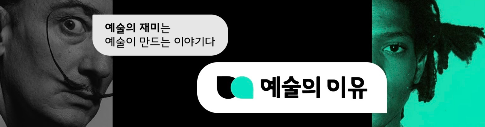

유튜브를 보다 보면 혼자 알기는 아쉬운 채널들이 있습니다. 오늘은 평소보다 조금 가벼운 마음으로 최근 구독해 재밌게 보고 있는 유튜브 채널 3곳을 공유하려고 합니다.

## [Kurzgesagt - In a Nutshell](https://www.youtube.com/user/Kurzgesagt)

Kurzgesagt은 2013년에 창립한 뮌헨에 있는 모션 그래픽 애니메이션, 디자인 스튜디오가 운영하는 유튜브 채널입니다. Kurzgesagt이라는 이름 역시 독일어로, 직역하면 "짧게 말해서"라는 뜻이라고 합니다. 하나의 영상이 대략 10분 내외로 구성되어 있고, 과학, 정치, 사회에 관련된 다양한 애니메이션을 업로드 합니다.

### 추천 이유

- 우선 영상미가 대단히 뛰어납니다. 꾸준히 업데이트되는 무료 채널 중에서 이렇게 뛰어난 모션그래픽 애니메이션을 업로드 하는 채널은 세계적으로 봐도 손에 꼽힐 정도가 아닐까 싶습니다.
- Kurzgesagt의 영상을 보고 나면 인생에 대해 깊게 생각하게 됩니다. 우주과학에 대해 다룬 영상들이 많다 보니, 영상들을 쭉 보고 나면 이 거대한 우주에 비해 인간이 얼마나 작은 존재인가 자문하게 됩니다. 하지만 이게 곧 허무주의로 이어지게 방치하지는 않습니다. Kurzgesagt은 단순히 우리는 참 작은 존재다! 라고 말하는 것에 그치지 않고, 그 거대한 우주에서 우리가 어떤 의미를 만들 것인가. 또 이 거대한 우주를 어떻게 개척할 것인가 등의 영상도 다루며 좀 더 존재의 의미를 한 번 더 되돌아보게 해줍니다.
  - 물론 이런 무거운 주제들뿐 아니라 코로나바이러스나 외로움 같은 조금 더 작은 스케일(?)의 주제를 다룬 영상들도 다양하게 준비되어 있습니다.
- 성우의 목소리가 정말 좋습니다. 영상미와 함께 몰입도를 높이는 또 하나의 매력 포인트입니다. 참고로 Kurzgesagt의 Patreon 특전 중에는 $75를 지불하면 이 목소리로 Voicemail을 녹음할 수 있는 멤버십도 있습니다.
- 최신 영상을 제외하면 영상 대부분이 한국어 자막과 함께 업로드되어 있어 영어를 잘하지 못 해도 편하게 볼 수 있습니다.

### 추천 영상

<iframe width="1280" height="720" src="https://www.youtube.com/embed/h6fcK_fRYaI" frameborder="0" allow="accelerometer; autoplay; clipboard-write; encrypted-media; gyroscope; picture-in-picture" allowfullscreen></iframe>

좀 더 우주과학적인 영상들이 이 채널의 매력을 잘 알릴 수 있다고 생각하지만, 제가 가장 좋아하는 영상이 무엇인가를 생각하면 제일 먼저 떠오르는 영상은 바로 이 "The Egg"입니다. 앤디 위어의 소설을 원작으로 한 이 영상은 이 채널을 알게 된 첫 작품이기도 합니다. 살다 보면 종종 지금 사는 삶의 끝에 대해서 생각하게 되는데, 어찌 보면 제게는 이 영상에서 그리고 있는 사후세계가 가장 매력적인 것 같습니다. 현재의 삶도 충실히 살 수 있고, 또 삶 이후도 두렵지 않게 해주니까요.

## [WLDO](https://www.youtube.com/channel/UCijBTYEiKT1OJO54C6PnRqw)

WLDO는 최신 해외 이슈 및 마케팅 추세를 소개해주는 채널입니다. WLDO라는 채널명은 Who Let the Dogs Out의 줄임말로, 빠르고 신랄하게 이슈를 물어온다는 뜻으로 작명하셨다고 들었지만 정작 채널에서는 주로 왈도라고 불리는 것 같습니다. 일반적으로 각 영상은 하나의 주제를 중심으로 재미있고 신선한 광고를 다루고, 3줄 내외의 정리로 마무리되는 구조입니다.

### 추천 이유

- 단순히 광고를 모아서 보여주는 것에 그치지 않고 광고에서 주목할 포인트는 무엇인지, 쓰인 기법은 무엇인지, 세간의 반응은 어떠한지 등 광고를 바라보는 여러 가지 관점을 함께 제공해주는 점이 좋습니다.
- 짧고 간결해서 편하게 볼 수 있습니다. 광고 파트를 제외하면 영상 분량이 대부분 5~10분 내외로 그렇게 길지 않은 편입니다.
- 현재도 마케팅을 업으로 삼고 계시는 분이다 보니, 트렌드에 민감하고 퀄리티에 대한 기준도 상당히 높은 편입니다. 그래서 그런지 대부분의 영상이 뻔하지 않고 신선하다는 느낌을 받습니다. 덕분에 항상 영상을 보고나면 귀중한 인사이트를 얻게 되는 것 같습니다. 시청자의 눈높이에 잘 맞춰준다는 점도 좋고요. 저도 언젠가 이 블로그가 누군가에게 새로운 인사이트를 전해주는 채널이 되었으면 좋겠습니다.
- 먼저 소개했던 Kurzgesagt도 그렇지만 이 채널 역시 목소리가 아주 매력적인 채널입니다. 특히 스타카토라고 중요한 단어를 하나씩 띄어 말하고 마지막 한 글자를 조금 쉬고 뒤에 읽어주는 부분이 한 편에 하나 이상 있는데, 이것도 매력 포인트라고 생각합니다.

### 추천 영상

<iframe width="1280" height="720" src="https://www.youtube.com/embed/0XqxF3qhH-c" frameborder="0" allow="accelerometer; autoplay; clipboard-write; encrypted-media; gyroscope; picture-in-picture" allowfullscreen></iframe>

모두가 잘 알고 있는 과자인 치토스와 맛없는 거로 유명한 마마이트의 광고를 주제로 만든 영상입니다. 누구나 알고 있는 제품의 단점을 매력으로 승화시켰다는 점이 재미있는 광고들이었습니다. 이 영상을 포함해 슈퍼볼 광고들이 많이 다뤄지는데, 이 외에도 채널에 소개된 타이드나 현대자동차의 광고 영상도 흥미로운 포인트가 많으니 한 번 보시길 바랍니다!

## [예술의 이유](https://www.youtube.com/channel/UCOmQe3xlkx1f5J-y7X2dcSA)

예술의 이유는 <널 위한 문화예술>이라는 콘텐츠 스타트업에서 운영하는 예술, 특히 미술에 관련된 채널입니다. 회사명과 [동명의 채널](https://www.youtube.com/channel/UCZr3cu75jx6Sz-6KRQ50ySA)과 상호 보완적인 채널이기도 한데, 널 위한 문화예술은 "취향 발견"에 목표를 둔 채널이라 새로운 전시나 책, 작품 등을 소개해주는 한편, 예술의 이유는 "지식 함양"에 초점을 맞춰 그림을 보는 법, 예술가의 삶과 같은 예술 교양 콘텐츠들이 주를 이루고 있습니다. 두 채널 모두 좋아하지만, 특히 예술의 이유를 추천해 드리고 싶습니다.

### 추천 이유

- 이 채널은 "미술 감상을 어디서부터 어떻게 시작해야 하는지 모르는 사람"을 타겟으로 만들어진 채널입니다. 미술 감상은 누구나 한 번쯤 취미로 삼고 싶은 분야라고 생각합니다. 하지만 본격적으로 감상을 해보려고 하면 막상 진입장벽이 높아 좌절하게 되는 경우가 많습니다. 저 역시 그렇고요. 이 채널을 보다 보면 저 같은 사람들의 눈높이와 요구에 맞춰 설계되어 있다는 인상을 받습니다.
- 영상의 구성이 탄탄합니다. 각 영상은 채널의 제목처럼 대부분 "왜 ~일까?"라는 질문형 제목으로 이뤄져 있습니다. 평소 미술 감상을 하면서 궁금했던 것들, 또는 지금까지 생각해 본 적 없지만 질문을 보니 궁금해지는 것들. 이들을 영상의 축으로 세우고 그에 대한 다양한 대답을 이끌어나가는 방식으로 진행하다 보니 영상을 다 보고 나면 기억에 남는 것이 많습니다.

### 추천 영상

<iframe width="1280" height="720" src="https://www.youtube.com/embed/9cBbWQrz2aY" frameborder="0" allow="accelerometer; autoplay; clipboard-write; encrypted-media; gyroscope; picture-in-picture" allowfullscreen></iframe>

다른 영상들도 재밌지만, 개인적으로 이 영상만큼 그림을 "잘 읽어준" 영상은 없는 것 같습니다. 한 번쯤 어딘가에서 봤을 <아르놀피니 부부의 초상>을 주제로 한 이 영상에서는 작가와 작품, 역사를 넘나들며 설명을 이어가는데, 13분 정도 되는 영상이지만 몰입해서 잘 봤습니다. 몇 년 전 이 그림을 런던에서 처음 봤을 때 잘 모를 묘한 느낌과 인상을 받았는데, 이 영상을 통해 그 묘한 느낌이 어디서 비롯됐는지 알 수 있었고, 덕분에 희미했던 감상이 선명해질 수 있었습니다.
